# Project Ninja-Framework

### A RTC2 and Trojan-Malware Cyber-Attack Simulation System

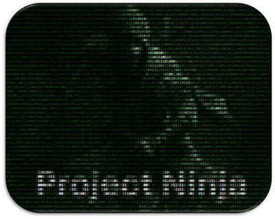

**Project Design Purpose:** In various cyber exercises or attack scenario demonstrations, there are needs for red team attackers to develop and control different types of malware to simulate attack scenario. Project Ninja-Framework aims to create a "light agent" malware, a attack activities library and C2 framework that allows red team developers to quickly build programs for generating malicious actions (malware emulation). This system also enables red team attackers dynamic adding new attack functions to an existing running malware during an attack, reducing the costs associated with repeated development, configuration, testing, and debugging.

The project is designed to provide a customizable Red Team Command and Control (RTC2) Trojan malware management and coordination system to full fill the cyber security **SDR** requirement: 

- [**S**] (Simulation & Supporting ): Simulate and control various malwares attack, supporting cyber exercise attack management.
- [**D**] (Development & Detection):  Develop malware and facilitate threat detection testing.
- [**R**] (Repeating & Research): Repeat cyber attack scenarios and support attack research initiatives.

The system overview is shown below diagram:

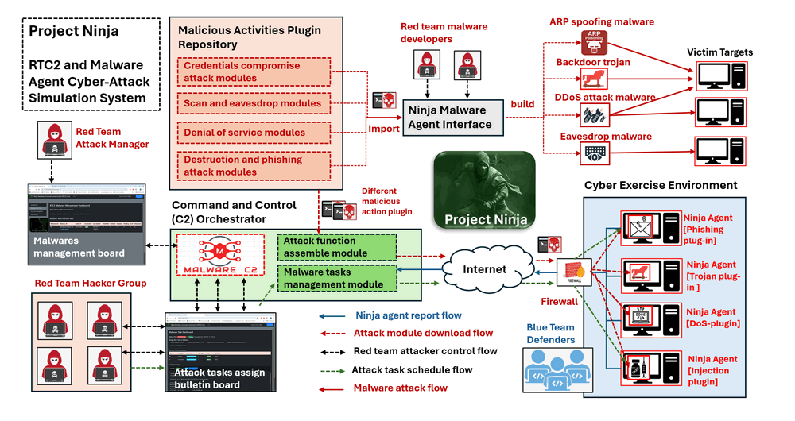

` Figure-00: Ninja-Framework system workflow diagram, version v0.2.3 (2024)`

```
# Created:     2023/08/13
# version:     v0.2.3
# Copyright:   Copyright (c) 2024 LiuYuancheng
# License:     MIT License
```

> Important: This project is used for cyber exercise and attack demo, please don't apply it on the other service.  

**Table of Contents**

[TOC]

- [Project Ninja-Framework](#project-ninja-framework)
    + [A RTC2 and Trojan-Malware Cyber-Attack Simulation System](#a-rtc2-and-trojan-malware-cyber-attack-simulation-system)
    + [Introduction](#introduction)
      - [Malicious Activities Module Repository Introduction](#malicious-activities-module-repository-introduction)
      - [Ninja Malware Agent Interface Introduction](#ninja-malware-agent-interface-introduction)
      - [Command and Control (C2) Orchestrator Introduction](#command-and-control--c2--orchestrator-introduction)
    + [Project Use Cases](#project-use-cases)
      - [Project Used Cyber Exercise](#project-used-cyber-exercise)
      - [Usage Scenario Introduction](#usage-scenario-introduction)
    + [System Design](#system-design)
      - [Polymorphism Malware Design](#polymorphism-malware-design)
      - [Centralized Control and Task Distribution](#centralized-control-and-task-distribution)
      - [Dynamic Malware Action Code Execution Design](#dynamic-malware-action-code-execution-design)
      - [Camouflage Action and Trace Erase Design](#camouflage-action-and-trace-erase-design)
      - [Malware Execution Self Protection Design](#malware-execution-self-protection-design)
    + [System Setup and Usage](#system-setup-and-usage)
      - [System Setup](#system-setup)
        * [Setup Ninja Malware Agent Interface](#setup-ninja-malware-agent-interface)
        * [Setup Command and Control (C2) Orchestrator](#setup-command-and-control--c2--orchestrator)
      - [System Usage](#system-usage)
    + [Problem and Solution](#problem-and-solution)

------

### Introduction 

The Project Ninja is a cyber attack simulation toolkit designed for red team attackers to rapidly and dynamically develop and deploy various types of cyber attacks. The system is composed of a Command and Control (C2) hub and multiple distributed Trojan-Malware agents with below five main features: 

- **Polymorphic Malware Construction:** A simple agent with a C2 tasks synchronization interface and a library of malicious activity plugins allows for customized construction of various types of malware.
- **Centralized Control and Task Distribution:** The C2 attack tasks synchronization mechanism enables attackers to dynamically control the functions of different Ninja malware agents.
- **Dynamic Malware Action Code Execution:** Users(red team attackers) can dynamically plug in attack modules or even execute code sections during malware runtime.
- **Camouflage Actions and Trace Erasure:** The system disguises attack actions and communications as normal software operations and erases traces to evade defender track logs.
- **Malware Self-Protection:** A self-protection watchdog prevents the malware from being terminated or deleted if it is detected by anti-malware software or defenders.

The project consists of three sub-projects: Malicious Activities Module Repository, Ninja Malware Agent interface and Command and Control (C2) Orchestrator as shown below:

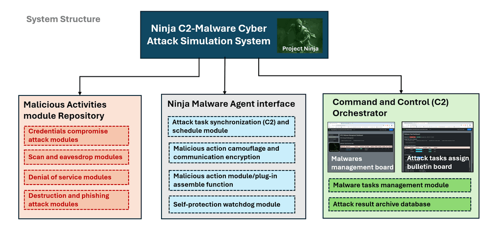

` Figure-01: Ninja-Framework system structure diagram, version v0.2.3 (2024)`

#### Malicious Activities Module Repository Introduction

The Malicious Activities Module Repository is a Python library containing various plugins for generating attack activities aimed at disrupting computer system, network device, or service. All plugin modules can be executed individually as a small attack malware or imported as functions to run within the [ Ninja Agent ] module, enabling the construction of more complex attack paths. 

The repository provides five types of attack modules:

- **Credentials Compromise Module**: These modules are used to compromise the target's security information by stealing files or scanning user traces. Functions include: `File/data stolen`, `Cmd history scanning`, `User password crack` and `Browser cookie hijacking`.
- **Phishing and Scam Module**: These modules generate phishing emails or scams to mislead users into downloading malicious resources or viewing malicious links. Functions include: `Phishing email generation`, `Scam Telegram message boom` , `backdoor/spy trojan` and `Scam popup advertisement generation`. 
- **Scan and Record Module**: These modules record user actions and scan the victim's network/target. Functions include: `Network scanning`, `Service probing`, `Traffic mirroring` , `Screen recording` and `Keyboard logging` .
- **Denial of Service Module**: These modules disable or interrupt the targeted victim's service. Functions include:  `ARP spoofing`, `Man in the middle attack` , `DDoS Attack`, `Hardware freeze/disable` and `Packet blocking `

- **System Destruction Module** : These modules are used to destroy the target OS. Functions include: `File-sys destructing`, `Malware injection` , `FDI and FCI`, `malware protection watchdog` and `python-lib hijack`


#### Ninja Malware Agent Interface Introduction

The Ninja Malware Agent Interface is a lightweight agent interface program that allows users to assemble various malicious plugin modules to build a customized malware or run on the victim's system to dynamically download these attack plugins from the [ Malicious Activities Module Repository ] . 

The agent provides four basic malware functions:

- **RTC2 Tasks Synchronization:** Automatically synchronizes attack tasks and schedules with the user's settings on RTC2.
- **RTC2 Communication Encryption:** Camouflages communication to avoid firewall threats detection and encrypts messages to prevent defenders from analyzing the traffic.
- **Action Camouflage and Code Obfuscation:** Camouflages attacks as normal user actions and obfuscates source code to prevent defenders from analyzing the source code, even if they success decompiled the plugin module.
- **Trace Erasure and Self-Protection:** Erases attack traces to prevent defenders from analyzing logs and includes an embedded self-protection watchdog to prevent malware processes from being terminated or deleted.

The agent is also an interface class for red team developers to inherit it as a code base to implement their own malware by adding their customized attack actions into it.


#### Command and Control (C2) Orchestrator Introduction 

The C2 Orchestrator is the main control center for all malware agents and acts as the "bridge" between agents and the Malicious Activities Module Repository. It provides various dashboard UI and API interfaces for red team attackers to inject attack plugins into Ninja Malware agents, assign and schedule attacks, monitor attack progress, and review attack results. 

In cyber exercise, red team attack group can management all malware agents which register in RTC2 via web UI. Then can also write a program to invoke the C2 API to automate control the attack progress. The main agent management and attack tasks control dashboards are shown below:

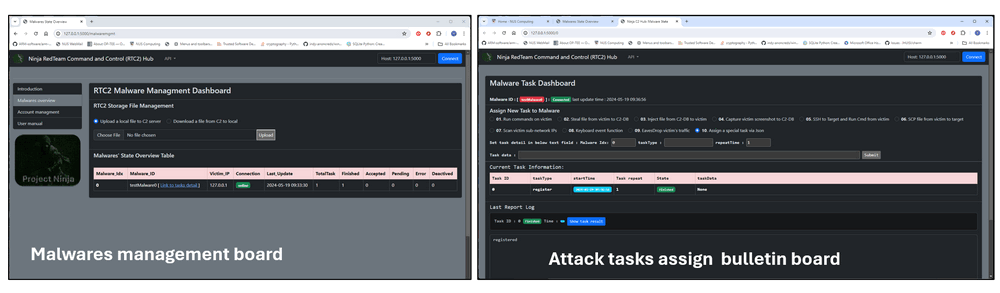

` Figure-03: C2 dashboards screenshot, version v0.2.3 (2024)`

The RTC2 Orchestrator include three main functions: 

- **Malware Agent Management**: The C2 management interface allows cyber exercise red team managers to enable/disable malware and manage the agents' attack plugin import process.

- **Assign & Schedule the Attack Tasks**: The C2 task-config interface enables the cyber exercise red team attack implementation group to set up attack tasks, configure attack sequences/paths, and schedule attack times during the exercise.

- **Archive the Attack Result**: Allows the red team to view attack results, archive critical information and monitor attack progress.  

> For detailed Command and Control (C2) Orchestrator Introduction, please refer to link: [RTC2 Readme Doc](src/ninjaC2Hub/readme.md)


------

### Project Use Cases

Our system has been used in several cyber exercise attack demo or digital forensics files collection to build the malware simulation program or test the threats detection function of firewall. 

#### Project Used Cyber Exercise 

- **CROSS SWORD 2023 (XS2023)**: The Ninja-Framework RTC2 and Trojan-Malware Cyber-Attack Simulation System (version v0.1.3 2023) we developed  was used for one of the partner run attack demo on railway system in CROSS SWORD 2023 cyber exercise. 
- **Locked Shields 2024 (LS2024)**: The Ninja-Framework RTC2 and Trojan-Malware Cyber-Attack Simulation System (version v0.2.1 2024) is used for contributing to a Forensic Evidence Trail in LS2024 ( Apr 2024 ), the project is used part of the Digital Forensics and Incident Response ( DFIR ) event. 

#### Usage Scenario Introduction

Follow below workflow diagram to build different malware or malicious action generation program.   

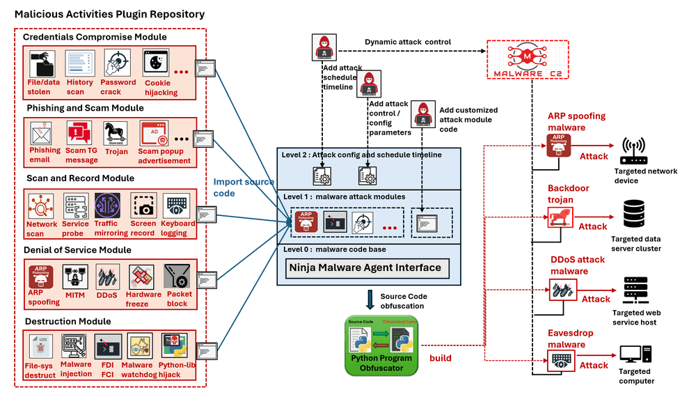

` Figure-03-1: Ninja Malware Agent Interface workflow diagram, version v0.2.3 (2024)`

The red team attacker can follow these steps to build a customized malware for use in cyber exercises:

1. Create a Python program that inherits from the Ninja malware agent interface as the code base.
2. Import the relevant attack activity modules from the plug-in repository into the malware.
3. Add any special attack modules if needed.
4. Configure the attack control parameters and sequence.
5. Set the attack schedule timeline.
6. Run source code obfuscation to camouflage the malicious code.
7. Deploy the malware and control the attack via RTC2.


**Scenario-02 Use RTC2 orchestrator and deployed agent to control the cyber exercise attack progress**

Follow below workflow diagram to control and monitor the cyber attack in cyber exercise or test the firewall threats detection. 

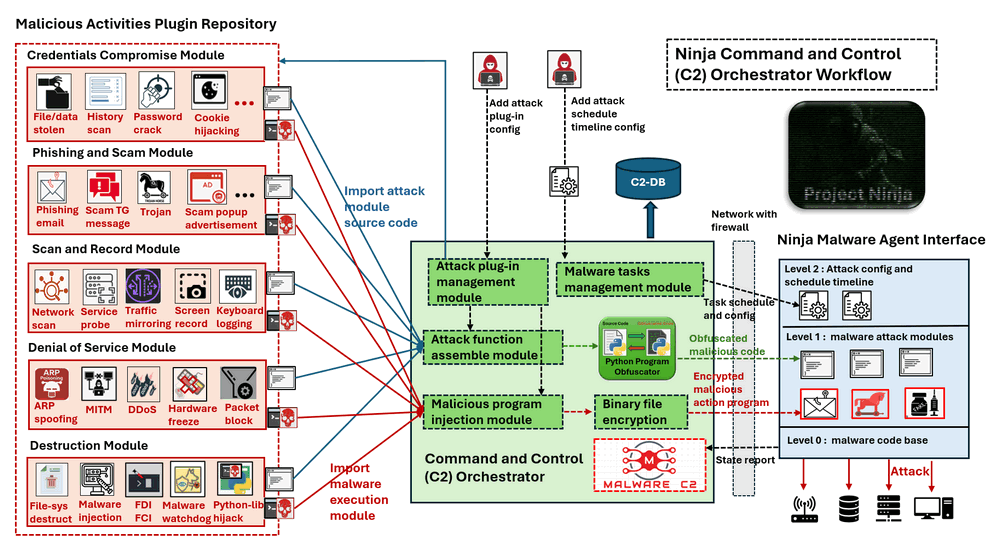

` Figure-03-2: Command and Control (C2) Orchestrator workflow diagram, version v0.2.3 (2024)`

When a red team attacker assigns an attack schedule to a Ninja malware agent, if the agent contains all the necessary attack modules, it will initiate the attack according to the scheduled timeline. If the Ninja agent lacks the configured attack function, it will follow these steps to retrieve the required attack plugin from RTC2:

1. The red team attacker uses the `Attack Plug-in Management Module` to fetch the `malicious source code` or `executable binary malicious plug-in` from the Malicious Activities Plugin Repository.
2. To avoid detection by firewalls or antimalware systems, the attack source code is obfuscated into unreadable binary data, and the executable malicious program is encrypted into a binary stream.
3. Then the obfuscated source code or the encrypted attack binary will be download by the agent before the attack. 
4. The agent de-obfuscates the source code or decrypts the attack executable binary, assembles them into its local attack module list, and initiates the attack based on the schedule.

After completing the attack, the Ninja malware reports the results to RTC2 for database archiving. If the downloaded attack module is no longer needed, the agent will delete the module.


------

### System Design 

The idea of the project name comes from a Japanese comic book "Naruto", this project offers various groups of centralized controlled "Ninja" malware designed for launching cyber attacks on specific targets. In this section we will introduce the design logic of each features of the system. 


#### Polymorphism Malware Design

In the realm of Ninjas, each individual possesses fundamental skills like infiltration, complemented by specific specialties such as information gathering or assassination. Our system mirrors this concept, where all Ninja malwares inherit core functionalities from basic Ninja malware. The basic malware execute fundamental malicious actions like running commands, stealing files, and injecting malware onto the victim. Additionally, each advanced Ninja malware integrates with specialized modules for specific tasks, such as Modbus-FDI, Man-in-the-Middle (MITM) attacks, ARP spoofing, and system compromise. This modular approach enables the Ninjas to adapt and execute a diverse range of malicious actions tailored to particular objectives. 

The Ninja malware family tree is shown below: 

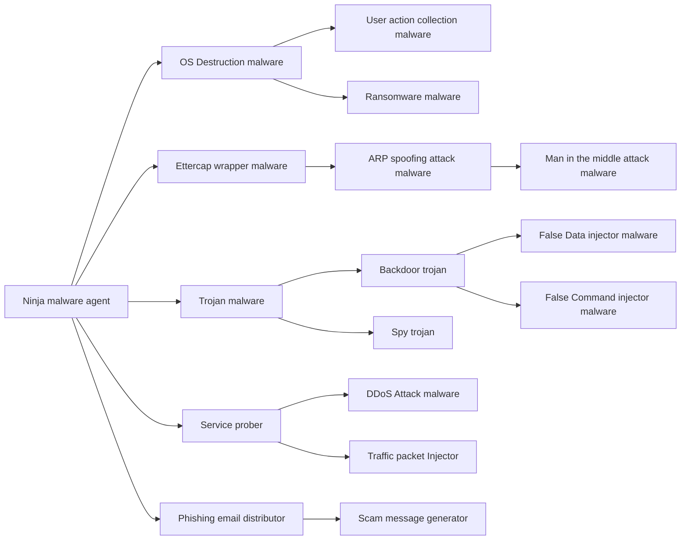

` Figure-04: Ninja malware family tree diagram, version v0.2.3 (2024)`

For the basic Ninja malware agent, it will provide 8 basic build-in attack functions, so all the other ninja malware inherited from it will also have these functions. The function table is shown below:

| Agent Name                     | level | Attack function number | Special added attack function                                |
| ------------------------------ | ----- | ---------------------- | ------------------------------------------------------------ |
| Ninja malware agent            | lvl0  | 8                      | 01 Run commands on victim, 02 Steal file from victim to C2-DB, 03 Inject file from C2-DB to victim, 04 Capture victim screenshot to C2-DB, 05 SSH to Target and Run Cmd from victim, 06 SCP file from victim to target, 07 Keyboard event function, 08 Eavesdrop victim's traffic. |
| OS Destruction malware         | lvl1  | 10                     | 01 - 08 All the `Ninja malware agent` functions, 09 Victim computer memory full filled function, 10 Victim computer keyboard and mouse freeze function. |
| User action collection malware | lvl2  | 13                     | 01 - 10 All the `OS Destruction malware` functions, 11 User commands history collection function, 12 User keyboard type in logging function, 13 User browser cookies collection function. |
| Ransomware malware             | lvl2  | 13                     | 01 - 10 All the `OS Destruction malware` functions, 11 User file encryption function, 12 User desktop screen freeze function, 13 User camera record function. |
| Ettercap Wrapper Malware       | lvl1  | 9                      | 01 - 08 All the `Ninja malware agent` functions, 09 ARP poisoning attack function. |
| ARP spoofing attacker          | lvl2  | 10                     | 01 - 09 All the `Ettercap Wrapper Malware` functions, 09 Network traffic mirroring function, 10 Network packet drop and lock function. |
| MITM attacker                  | lvl3  | 11                     | 01 - 10 All the `ARP spoofing attacker` functions, 11 MITM packet data filtering and modification function. |
| Trojan Malware                 | lvl1  | 09                     | 01 - 08 All the `Ninja malware agent` functions, 09 Credential files searching function |
| Spy trojan malware             | lvl2  | 12                     | 01 - 09 All the `Trojan Malware` functions, 10 User desktop recording  function, 11 User keyboard input logging and type in simulation function, 12 User credential (username, password ) record function. |
| Backdoor Trojan Malware        | lvl2  | 12                     | 01 - 09 All the `Trojan Malware` functions, 10 Victim node's network interface traffic mirroring function, 11 SSH connection, reverse SSH, SCP, SSH port forwarding, 12 UDP server backdoor function and port bind function. |
| False data injector            | lvl3  | 14                     | 01 - 12 All the `Backdoor Trojan Malware` functions, 13 Modbus data fetching function, 14 High frequency holding register data overwrite function. |
| False Command injector         | lvl3  | 13                     | 01 - 12 All the `Backdoor Trojan Malware` functions, 13 Fake PLC memory and coil setting command inject function. |
| Service prober                 | lvl1  | 9                      | 01 - 08 All the `Ninja malware agent` functions, 09 network service probing function. |
| DDoS attacker                  | lvl2  | 10                     | 01 - 09 All the `Service prober` functions, 10 DDoS attack function. |
| Traffic packet injector        | lvl2  | 10                     | 01 - 09 All the `Service prober` functions, 10 service API request injection function. |
| Phishing email distributor     | lvl1  | 10                     | 01 - 08 All the `Ninja malware agent` functions, 09 Phishing email contents generate function, 10 Phishing email deployment function. |
| Scam message generator         | lvl2  | 11                     | 01 - 10 All the Phishing email distributor functions, 11 Scam message generate function. |
|                                |       |                        |                                                              |


#### Centralized Control and Task Distribution

In every Ninja village, a shadow leader is responsible for task assignment to all other Ninjas. Similarly, in our system, the red team attack group hacker assumes the role of the leader, leveraging a centralized controlled RTC2 (Red Team Command and Control) system. Through this system, the hacker can seamlessly allocate tasks to any of the "Ninja" via the bulletin board. The Ninjas, represented by malware entities, retrieve their tasks from the bulletin board and subsequently report the results of their task execution back to the same interface. 

The control follow overview is shown below: 

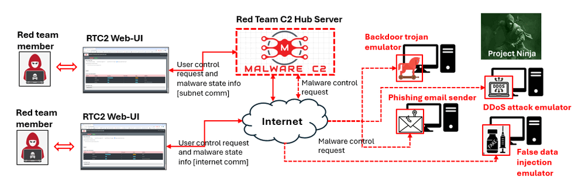

` Figure-05: RTC2 attack tasks distribution workflow diagram, version v0.2.1 (2023)`

The RTC2 ( red team command and control ) system will provide a multi-threading based client which users can easily hook the client into their malicious action program to integrate in the RTC2 system.  The RTC2 server not only offers a robust back-end but also comes equipped with a user-friendly web interface and an HTTP request handler API. So the users to can remote control the integrated malware effortlessly—either through a web browser or their custom programs. This combination of adaptability and accessibility enhances the user experience, providing a versatile platform for managing and orchestrating their cyber exercise scenarios.

The system work flow timeline UML diagram:

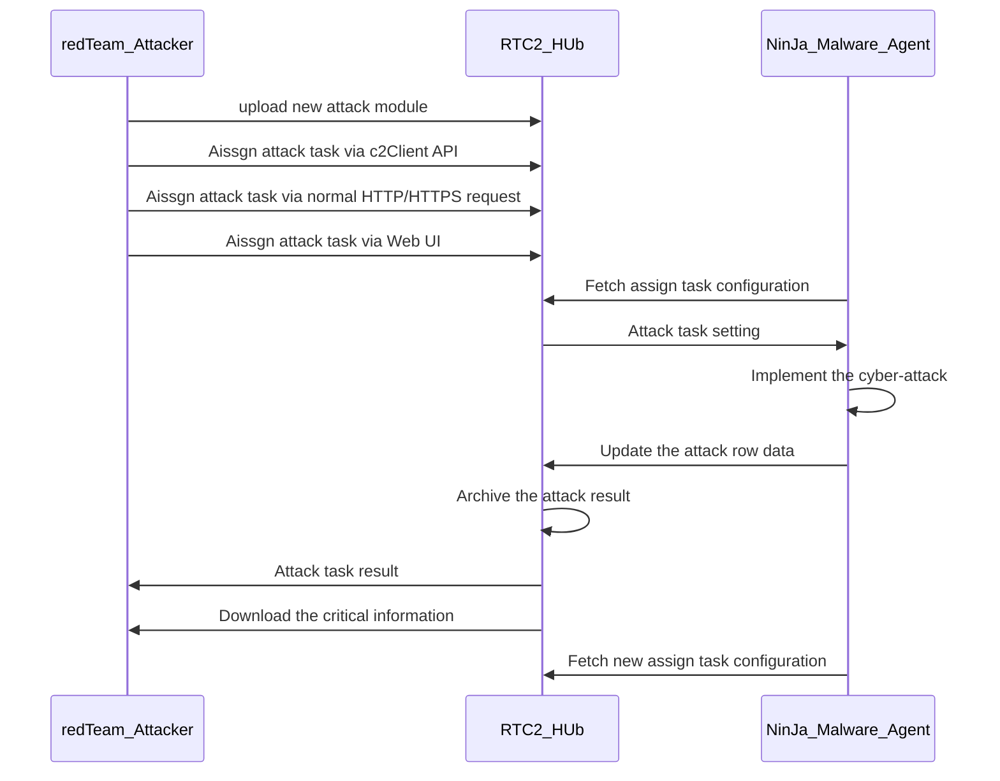

` Figure-06: RTC2 attack tasks distribution workflow timeline UML diagram, version v0.2.3 (2024)`

All communications within this system are encrypted, ensuring secure transmission of information. The shadow leader can assign tasks from any location on the internet, and due to the indirect communication approach, even if defenders attempt to trace the communication, they would only be led to the bulletin board and not the direct interaction between the hacker and the malware.


#### Dynamic Malware Action Code Execution Design

The Ninja possesses an arsenal of diverse weapons, and our system facilitates a dynamic attack action repository that allows for real-time integration. Hackers can seamlessly attach attack modules to tasks via the bulletin board. The default basic malicious action plug-in modules provided includes : 

- Run commands on victim
- Steal file from victim to C2-DB
- Inject file from C2-DB to victim
- Capture victim screenshot and upload to C2-DB
- SSH to target and run command from victim
- SCP file from victim to target
- Scan victim sub-network IPs
- Generate or record keyboard event
- Eavesdrop victim's traffic in pcap file

When a Ninja receives a task, it automatically equips the assigned attack module, enabling it to perform the specified attack action. For instance, a spy-trojan Ninja, designed for collecting credentials, can be enhanced with additional capabilities. If the hacker assigns a False Data Injection(FDI) task to it, the Ninja will dynamically download the necessary modules, such as the network scan module and Modbus-FDI module, transforming itself into an adept FDI attack program. This modular approach ensures adaptability and precision in executing a wide range of attack actions based on task assignments.

> **Remark** : follow this example to build the modulus attack program: https://github.com/LiuYuancheng/Python_Malwares_Repo/tree/main/src/falseCmdInjector


#### Camouflage Action and Trace Erase Design 

Upon completion of a task, the Ninja efficiently erases any traces of its activities. It will camouflage action, source code obfuscation and trace erase to avoid the threat detection.   

- **Camouflage action**: The Ninja Agent will use random time interval and mixed task execution sequence with real human action to make the attack action difficult to be detection. For example, when the agent accept a file delete attack task, it will monitor the node user's action, if the node user did some file operation, it will do the file delete after the user's file operation action.   
- **Trace Erase**: The tasks assigned to the Ninja are saved the in the memory as a linked list, there is no code based tasks line and the malware only keep the pointer to the current task. For example if a Ninja got 4 tasks to break a system, when the Ninja malware finished the tasks and break the system, all the tasks data will be removed from the program execution memory the data store parameters will be cleared, so even the the defender detected error and "catch" the Ninja program, from the memory dump they will not able to reconstruct the tasks list from program or from the memory dump. If the malware need to download some attack plug-in from the C2-hub, it will also auto-remove the attack plug-in after finished the attack. 
- **Attack Code Obfuscation**: For malicious code injection, the code will be obfuscated to unreadable byte steam with an execution covert program to avoid the cyber defender to detect the attack action via code review. The code obfuscation example is shown below:

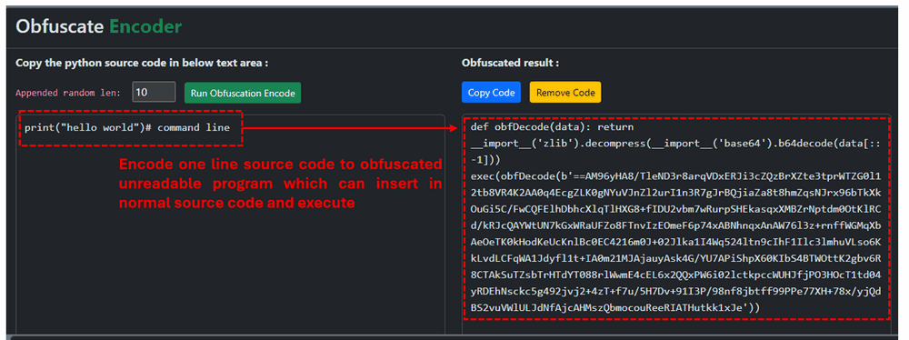

` Figure-07: Attack Code Obfuscation example, version v0.2.3 (2024)`

> **Reference** For the source code obfuscation detail document, please refer to : https://github.com/LiuYuancheng/Py-Code-Obfuscator


#### Malware Execution Self Protection Design 

Engaging in a strategic confrontation with defenders, each Ninja is paired with a Ninja-dog, functioning as a program protection watchdog. If the Ninja malware is killed/deleted by the anti malware program or the user, the Ninja-dog will recover the Ninja malware automatically. 

The Agent and process protection watch dog workflow is shown below:

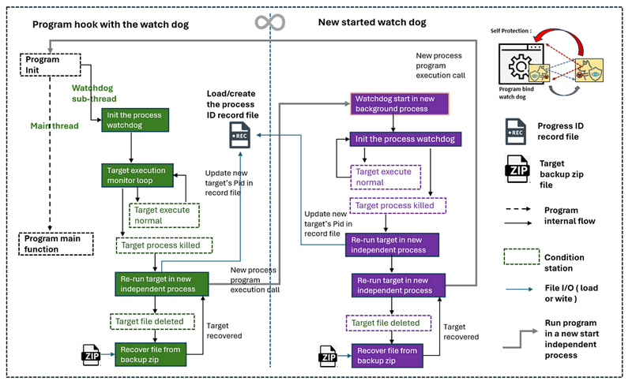

` Figure-08:Malware agent Self Protection watchdog workflow diagram, version v0.2.3 (2024)`

The program protection watchdog will run in sub-thread parallel with the main hooked program thread. It will monitor the protect target's process, if the target process is stopped, it will start a new individual process to run the target. In a self-protective scenario, the watchdog spawns a twin "shadow" watchdog in the background as a separate individual process. This dual-layered defense strategy involves the primary program's watchdog safeguarding the shadow watchdog, while the shadow watchdog reciprocally protects the main program. This intricate protection deadlock mechanism ensures a robust shield against potential disruptions, creating a resilient and interlocked defense system. 

At the same time if a Ninja detected it is recovered from a Ninja-dog, it will start a sub process to active the self protection feature: lock the victim's mouse+keyboard input, freeze screen and start to use garbage to full fill the memory to cause a slowdown in the system's performance. These defensive mechanisms enhance the resilience and adaptability of the Ninjas in the face of countermeasures initiated by defenders.

> **Reference**  For use and config the watchdog, please refer to this document: https://github.com/LiuYuancheng/Python_Malwares_Repo/tree/main/src/processWatchDog


------

### System Setup and Usage

If you want to use the system, please follow below section to setup and use the API

#### System Setup

**Development/Execution Environment** : python 3.7.4+

**Additional Lib/Software Need** 

| Lib Module         | Version  | Installation                 | Lib link                                                     |
| ------------------ | -------- | ---------------------------- | ------------------------------------------------------------ |
| **Flask**          | 1.1.2    | `pip install Flask`          | https://flask.palletsprojects.com/en/3.0.x/                  |
| **Flask_SocketIO** | 5.3.5    | `pip install flask-socketio` | https://flask-socketio.readthedocs.io/en/latest/             |
| **requests**       | 2.28.1   | `pip install requests`       | https://pypi.org/project/requests/                           |
| **Ettercap**       |          |                              | https://installati.one/install-ettercap-common-ubuntu-20-04/ |
| **keyboard**       | 0.13.5   | `pip install keyboard`       | https://pypi.org/project/keyboard/                           |
| **mouse**          | 0.7.1    | `pip install mouse`          | https://pypi.org/project/mouse/                              |
| **opencv_python**  | 4.5.1.48 | `pip install opencv-python`  | https://pypi.org/project/opencv-python/                      |
| **paramiko**       | 2.11.0   | `pip install paramiko`       | https://www.paramiko.org/                                    |
| **Pillow**         | 10.3.0   | `pip install pillow`         | https://pypi.org/project/pillow/                             |
| **psutil**         | 5.7.2    | `pip install psutil`         | https://pypi.org/project/psutil/                             |
| **pynput**         | 1.7.6    | `pip install pynput`         | https://pypi.org/project/pynput/                             |
| **pyscreenshot**   | 3.1      | `pip install pyscreenshot`   | https://pypi.org/project/pyscreenshot/                       |
| **pyshark**        | 0.4.3    | `pip install pyshark`        | https://pypi.org/project/pyshark/                            |
| **python_nmap**    | 0.7.1    | `pip install python-nmap`    | https://pypi.org/project/python-nmap/                        |
| **scp**            | 0.14.4   | `pip install scp`            | https://pypi.org/project/scp/                                |
| **sslkeylog**      | 0.5.0    | `pip install sslkeylog`      | https://pypi.org/project/sslkeylog/                          |
| **Werkzeug**       | 1.0.1    | `pip install Werkzeug`       | https://pypi.org/project/Werkzeug/                           |

##### Setup Ninja Malware Agent Interface

- To setup Ninja Malware Agent, refer to the setup section in the [Ninja Malware Agent Interface Readme file]()

##### Setup Command and Control (C2) Orchestrator 

- To Setup the Command and Control (C2) Orchestrator, refer to the setup section in [Command and Control (C2) Orchestrator Readme file](src/ninjaC2Hub/readme.md)


#### System Usage

To use the system refer to the API user manual:  [API Usage Manual](UsageManual.md) , the basic usage functions include:

- **Run commands on victim**:  Run one or multiple commands in the list sequence on the victim and archive the result in the C2 Data base.
- **Steal file from victim to C2-DB**: Search multiple files on victim based on the file path list and upload found files from victim local storage to RTC2's cloud storage data base. 
- **Inject file from C2-DB to victim**: Inject a file/attack_module from RTC2's cloud storage data base into the victim's local storage. 
- **Capture victim screenshot and upload to C2-DB**: Capture a screenshot of the victim's desktop and upload the image file to RTC2's cloud storage data base. 
- **SSH to target and run command from victim**: Control the victim machine to SSH login to another machine linked to the victim and run command on that machine. 
- **SCP file from victim to target**: SCP a file from victim storage to the SSH connected target node's logic user's home folder.
- **Scan victim sub-network IPs**: Scan the subnet victim node in and find all the touchable nodes IP addresses.
- **Generate or record keyboard event**: Generate or record the keyboard action/event on the victim machine. 
- **Eavesdrop victim's traffic in pcap file**: Eavesdrop the victim's network traffic and save the traffic packets in pcap file.


------

### Problem and Solution

If you got any problem or bug during the usage, please refer to `doc/ProblemAndSolution.md` to check whether there is any similar problem and we will provide the solution. 

------

> Last edit by LiuYuancheng (liu_yuan_cheng@hotmail.com) at 18/05/2024, if you have any problem or find anu bug, please send me a message .
