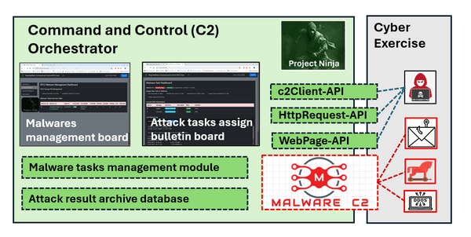
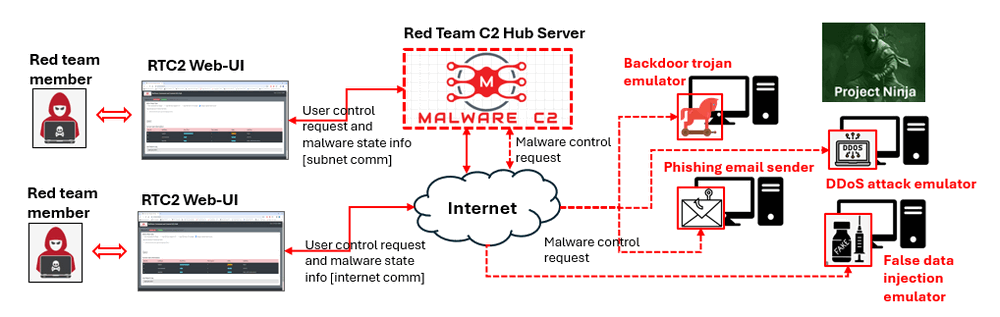
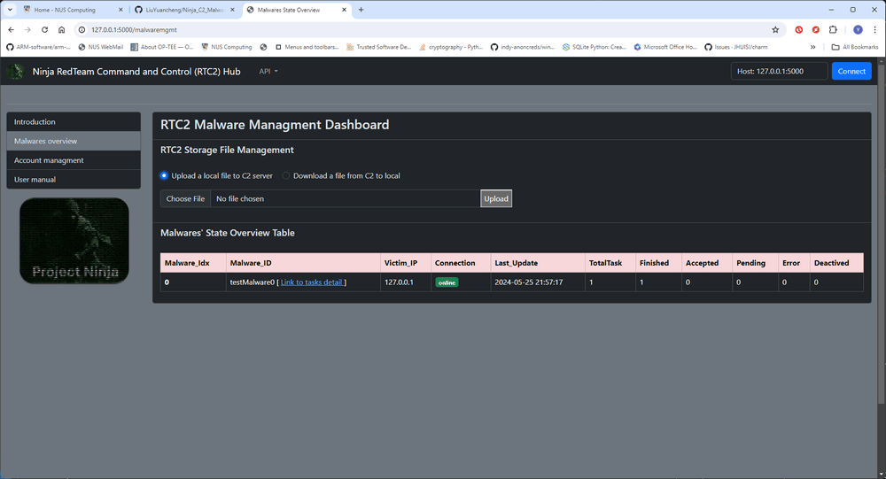

# **Command and Control (C2)** **Orchestrator**  



**Project Design Purpose** : The Red Team Command and Control (RTC2) server, commonly known as a C&C server, plays a pivotal role in cyber exercises and cyber ranges. It serves as a centralized hub that red team members use to control and communicate with simulated compromised victims. This command center enables red team members or attackers to seamlessly issue instructions to the compromised machines, collect data from them, and coordinate various malicious activities within the exercise program. Our goal is to offer a comprehensive C2 server emulation solution designed for cyber exercise red team members to control and monitor the linked Ninja Agent. This solution allows them to seamlessly integrate different probing programs and malicious action programs, providing dynamic monitoring, scheduling, and control capabilities. The versatility of our solution makes it applicable across a range of fields, offering a robust platform for enhancing cyber defense readiness and testing the resilience of security measures.

```
# Created:     2024/05/23
# version:     v0.2.3
# Copyright:   Copyright (c) 2024 LiuYuancheng
# License:     MIT License
```

**Table of Contents**

[TOC]

- [**Command and Control (C2)** **Orchestrator**](#--command-and-control--c2------orchestrator--)
    + [Introduction](#introduction)
        * [Cyber Exercise RTC2 Servers Setup](#cyber-exercise-rtc2-servers-setup)
        * [Defensive RTC2 and Threats Detection](#defensive-rtc2-and-threats-detection)
      - [RTC2-Hub Server Introduction](#rtc2-hub-server-introduction)
      - [RTC2-Client Module Introduction](#rtc2-client-module-introduction)
    + [System Design](#system-design)
      - [RTC2 Web Service API Design](#rtc2-web-service-api-design)
      - [Data Manager Functionality](#data-manager-functionality)
      - [Malware Task Queue Manager](#malware-task-queue-manager)
    + [System Setup](#system-setup)
        * [Development Environment : Python 3.7.4+](#development-environment---python-374-)
        * [Additional Lib/Software](#additional-lib-software)
        * [Customized Libraries](#customized-libraries)
        * [Program File List (ninjaC2Hub)](#program-file-list--ninjac2hub-)
    + [Program Usage](#program-usage)
      - [Program Execution](#program-execution)
      - [Web UI Dashboard](#web-ui-dashboard)
        * [Introduction Page (/index)](#introduction-page---index-)
        * [Malwares Management Page (/malwaremgmt)](#malwares-management-page---malwaremgmt-)
        * [Malware Task Management Page (/MalwraeID)](#malware-task-management-page---malwraeid-)
    + [Problem and Solution](#problem-and-solution)


------

### Introduction 

The Command and Control ( C2 ) servers are not inherently necessary or beneficial for legitimate and ethical purposes. However, there are situations in the realm of cybersecurity where the concept of command and control is used for defensive purposes, typically in the context of security operations and incident response. In these cases, organizations might employ C2 frameworks or systems to simulate the behavior of real-world attackers. These simulations help security professionals and organizations assess their ability to detect, respond to, and mitigate cyber threats. 

- The overview work flow of the RTC2 is shown below : 



` Figure-00: RTC2 and Ninja Agent overview diagram, version v0.2.1 (2023)`

The Command and Control (C2) Orchestrator is "plug and play" red team C2 solution which can be applied on below fields: 

##### Cyber Exercise RTC2 Servers Setup

- **Cyber Exercise Red Teaming :** Utilized by red teams for the seamless control of simulated threats, including DDoS attacks simulator, data theft programs, and phishing data generators, providing a comprehensive toolset for enhancing defensive capabilities.
- **Forensic Traffic Research:** Designed to simulate and replicate different attack scenarios, the C2 solution facilitates research and forensic analysis for C2 detection. This capability is instrumental in understanding and fortifying against potential cyber threats.

##### Defensive RTC2 and Threats Detection

- **Red Team Operations:** In the context of cybersecurity exercises, red teams (ethical hackers) may use C2 frameworks to simulate the tactics, techniques, and procedures (TTPs) of real-world adversaries. This helps organizations test their defenses and improve their incident response capabilities.
- **Training and Simulation:** Security professionals use C2 frameworks for training purposes, allowing them to understand and practice responding to simulated cyber threats in a controlled environment.


#### RTC2-Hub Server Introduction   

This web hosting program serves as a centralized control hub for managing various Red-Teaming- Malicious-Action-Programs and handling user requirements. The key functionalities include:

-  **Web-UI Task Assignment:** Users can employ the intuitive web interface to remotely assign diverse tasks to specific Malicious Action Programs. This includes executing commands on the victim, uploading files from the victim's machine, injecting other programs, or recording the victim's user actions.
- **"Bridge" for File Transfer :** The C2 Hub Server acts as a secure "bridge," facilitating the seamless transfer of files between the victim machine and the red team attackers' local folder without requiring additional authorization on the victim's end.
- **State Monitoring Dashboard :** Users have access to a comprehensive web dashboard, allowing them to monitor the execution state of malicious action agent programs on the victim machines.
- **Web-API Automation:** For streamlined control, users and their programs can leverage the web API to automate the control of all linked malicious action agent programs within the C2 framework. This ensures a dynamic and responsive environment for managing and orchestrating red team operations effectively.


#### RTC2-Client Module Introduction

The RTC2 client (Ninja Agent) is a multi-threading based client which users can hook it to their Red-Teaming-Malicious-Action-Programs to communicate with the C2 Hub Server. The key functionalities include:

- **Parallel Execution :** Running in parallel with the main thread of the Red-Teaming-Malicious-Action-Program, the RTC2 Client regularly reports the program's state and task execution results to the RTC2 Hub Server. This ensures real-time updates and streamlined coordination.
- **Task Assignment:** The RTC2 Client fetches detailed tasks assigned by the RTC2 Hub, facilitating the execution of related functions within the Red-Teaming-Malicious-Action-Program. This dynamic interaction enhances the adaptability of the client in responding to varied tasks.
- **File/Data Handling:** The client adeptly manages file and data translation requests from the RTC2 Hub, ensuring seamless and secure communication. This functionality ensures efficient and secure transfer of information between the Red-Teaming-Malicious-Action-Program and the C2 Hub Server.


------

### System Design

We have used the Python-Flask framework to construct our web hosting platform, offering a robust foundation for users. The system provides a multi-threading API handling function, enabling concurrent utilization by multiple users to control multiple Red-Teaming-Malicious-Action-Program (Ninja Agent) simultaneously.

The RTC2 system workflow is delineated below:


` Figure-01: RTC2 and Ninja Agent workflow in cyber execise, version v0.2.3 (2024)`

When a red team attacker assigns an attack schedule to a Ninja malware agent, if the agent contains all the necessary attack modules, it will initiate the attack according to the scheduled timeline. If the Ninja agent lacks the configured attack function, it will follow these steps to retrieve the required attack plugin from RTC2:

1. The red team attacker uses the `Attack Plug-in Management Module` to fetch the `malicious source code` or `executable binary malicious plug-in` from the Malicious Activities Plugin Repository.
2. To avoid detection by firewalls or antimalware systems, the attack source code is obfuscated into unreadable binary data, and the executable malicious program is encrypted into a binary stream.
3. Then the obfuscated source code or the encrypted attack binary will be download by the agent before the attack. 
4. The agent de-obfuscates the source code or decrypts the attack executable binary, assembles them into its local attack module list, and initiates the attack based on the schedule.

After completing the attack, the Ninja malware reports the results to RTC2 for database archiving. If the downloaded attack module is no longer needed, the agent will delete the module.


#### RTC2 Web Service API Design 

The RTC2 Web Service offers three distinct HTTP/HTTPS APIs designed to accommodate various requests:

1. **User Web Control API:** This API delivers a diverse user interface, empowering users to assign tasks to malware seamlessly. It includes multiple dashboards tailored for red team users, facilitating the monitoring of Red-Teaming-Malicious-Action-Program states and detailed execution tasks.
2. **Program Control API:** For enhanced flexibility, we provide an HTTP(S)-POST interface, enabling red team users to automate the control of all functions accessible through the web control API. This feature allows users to seamlessly integrate their programs with RTC2, streamlining the execution of tasks.
3. **Malware Communication API:** Specifically designed to handle communication from RTC2 clients connected to Red-Teaming-Malicious-Action-Program, this API manages data retrieval, task assignment, and file transfers. It serves as a robust bridge for effective communication and coordination between the RTC2 server and the hooked Red-Teaming-Malicious-Action-Programs.


#### Data Manager Functionality 

The Data Manager serves as the central "database" meticulously storing comprehensive information about each registered malicious action agent program. This includes a unique malware ID, victim IP address, task details, and intricate information for every task—such as `taskID`, `taskType`, `startTime`, `task repeat times`, `wait time before execution`, `task config parameters`, `task state,` and `task result`.

Upon red team members accessing the Red-Teaming-Malicious-Action-Program management web page, the Data Manager dynamically generates a malware state summary report. Furthermore, when navigating to the Red-Teaming-Malicious-Action-Program tasks page, the Data Manager retrieves and presents the malware's task summary report, enhancing visibility and control.

Upon the registration of a Malicious Action Program with the RTC2-Hub, the Data Manager receives and stores all re-configured task information. As an illustration, consider the example of a task where the Malicious Action Program is configured to upload a zipped file to the C2 server :

```
{	
	'taskID'	: 1,
    'taskType'	: 'upload',
    'startT'	: None,		# None means start immediatly if recevied 
    'repeat'	: 1,		# how many times to repeat the task.
    'exePreT'	: 0,		# time to wait before execution
    'taskData'	: [os.path.join(dirpath, "update_installer.zip")]
}
```

 

#### Malware Task Queue Manager 

The Malware Task Queue Manager plays a crucial role in RTC2, ensuring synchronization between tasks and the associated Malicious Action Programs while handling user-initiated task adjustments. This guarantees that the task queue of each Malicious Action Program aligns seamlessly with the RTC2 database. 

The following detailed steps outline the process when a user sets a task to request the C2 to upload a file:

1. A red team user initiates the task by specifying the upload file name through the web or program control API for Malicious Action Program-1.
2. The Task Queue Manager receives the request, generates detailed information for the file upload task, and enqueues it into Malicious Action Program-1's task queue.
3. Upon reporting to the RTC2-Hub, the Task Queue Manager dequeues the file upload task and transmits the task information to Malicious Action Program-1.
4. Malicious Action Program-1 enqueues the file upload task into its own task queue.
5. During the next execution of Malicious Action Program-1's task function, the program uploads the specified file to the RTC2-Hub.
6. The uploaded file is processed, and the Task Queue Manager updates the Data Manager's task record to reflect the completion of the task.

For each task displayed on the tasks dashboard, it will be under below five states : 

| Tasks state  | Tasks flag   | Description                                                  |
| ------------ | ------------ | ------------------------------------------------------------ |
| **Pending**  | `TASK_P_FLG` | Task is enqueued in the RTC2-Hub task manager's sending queue. |
| **Accepted** | `TASK_A_FLG` | Task information has been sent to related the Red-Teaming-Malicious-Action-Program. |
| **Finished** | `TASK_F_FLG` | Task execution finished and state updated in the RTC2-Hub.   |
| **Running**  | `TASK_R_FLG` | Task is executing.                                           |
| **Error**    | `TASK_E_FLG` | Tasks execution got error.                                   |


------

### System Setup

##### Development Environment : Python 3.7.4+

##### Additional Lib/Software 

| Lib Module         | Version | Installation                 | Lib link                                         |
| ------------------ | ------- | ---------------------------- | ------------------------------------------------ |
| **Flask**          | 1.1.2   | `pip install Flask`          | https://flask.palletsprojects.com/en/3.0.x/      |
| **Flask_SocketIO** | 5.3.5   | `pip install flask-socketio` | https://flask-socketio.readthedocs.io/en/latest/ |
| **requests**       | 2.28.1  | `pip install requests`       | https://pypi.org/project/requests/               |

##### Customized Libraries

library folder :  `src/lib`

Import modules:

- `src/lib/ ConfigLoader.py` : configuration file loading module.
-  `src/lib/ Log.py`: customized program execution log module.
- `src/lib/ c2Client.py`: RTC2 communication handling module. 
- `src/lib/ c2Constants.py`: RTC2 Constants define module.
- `src/lib/ c2MwUtils.py`: RTC2 function module.

##### Program File List (ninjaC2Hub)

| Program File             | Execution Env            | Description                                                  |
| ------------------------ | ------------------------ | ------------------------------------------------------------ |
| `c2App.py`               | python 3                 | Main flask webhost execution program.                        |
| `c2HubGlobal.py`         | python 3                 | Web host global parameters, instance and constants define module. |
| `c2DataManager.py`       | python 3                 | RTC2 data base management module.                            |
| `c2Config_template.txt`  | txt                      | Config file templated                                        |
| `SSLKeyLog/*.log`        | txt                      | All the SSL connected peer's key log files if C2 use https host type. |
| `cert/*pem`              | binary                   | Https host certificate and key storage folder.               |
| `fileFolder/*`           | Any                      | All the files upload from malware/hacker/victim, can also be download via download API. |
| `templates/*.html, *.js` | html, JavaScript, Jinja2 | All the web pages (flask default config)                     |
| `static/*`               |                          | All the web page resources (flask default config)            |
| `run.bat`                |                          | Windows execution bat file.                                  |


------

### Program Usage 

For detailed usage please refer to the `System Usage Manual.md` file: [>Link](../../UsageManual.md)

#### Program Execution 

Follow the `c2Config_template.txt` to create the `c2Config.txt` file:

```
# This is the config file template for the web host module <c2App.py>
# Setup the parameter with below format (every line follows <key>:<val> format, the
# key can not be changed):

#-----------------------------------------------------------------------------
# test mode flag, test mode will add a false malware in the C2
TEST_MD:False

# Init the flask execution parameters
#-----------------------------------------------------------------------------
# Init the connection protocol parameters

# Flag to indicate whether to use https: 
HTTPS:False

# https cert and key storage folder
CERT_DIR:cert
# https self signed cert files
CERT_FILE:cert.pem
KEY_FILE:key.pem

# Init th flag whether to save the connected peer's ssl key
RCD_SSL:True

# Init the folders 
#-----------------------------------------------------------------------------
# upload file storage folder
UPLOAD_FOLDER:filesFolder

# download file storage folder
DOWNLOAD_FOLDER:filesFolder

# Connected peer SSL key log folder
SSLKEYLOG_FOLDER:SSLKeyLog

#-----------------------------------------------------------------------------
# Init the Flask app parameters
FLASK_SER_PORT:5000
FLASK_DEBUG_MD:False
FLASK_MULTI_TH:True
```

For Linux and MAC user : 

```
Sudo python3 c2App.py
```

For Windows user (Or double click the `run.bat` file) : 

```
python c2App.py
```


#### Web UI Dashboard

After executed the web host, based on the config file web host port and https setting, Open Web URL `http(s)://<host_IP>:<port>/` , for example if running on local with https disabled open URL: http://127.0.0.1:5000/

##### Introduction Page (/index)

The introduction page will show the system overview and guide list of all the other page, the user can download/check the user manual by click the user manual link on the navigation bar. 


` Figure-03: RTC2 Orchestrator Introduction page screesnshot, version v0.2.3 (2024)`


##### Malwares Management Page (/malwaremgmt)

Click the "Malware overview" in the navigation bar to access the management page to check the malwares' states and the use the RTC2 database/storage file management function.    



` Figure-04: RTC2 Orchestrator Malwares Management Page screesnshot, version v0.2.3 (2024)`


##### Malware Task Management Page (/MalwraeID)

In the Malwares Management Page malware state over view table, select the file malware click the "link to tasks detail", a new page will popup and show the malware task control dashboard. The attacker can assign task to the malware, monitor the tasks execution information and check the task result. 


` Figure-05: RTC2 Orchestrator Malwares tasks managment page screesnshot, version v0.2.3 (2024)`

Ten default tasks are provided in this page:

1. **Run commands on victim**:  Run one or multiple commands in the list sequence on the victim and archive the result in the C2 Data base.
2. **Steal file from victim to C2-DB**: Search multiple files on victim based on the file path list and upload found files from victim local storage to RTC2's cloud storage data base. 
3. **Inject file from C2-DB to victim**: Inject a file/attack_module from RTC2's cloud storage data base into the victim's local storage. 
4. **Capture victim screenshot and upload to C2-DB**: Capture a screenshot of the victim's desktop and upload the image file to RTC2's cloud storage data base. 
5. **SSH to target and run command from victim**: Control the victim machine to SSH login to another machine linked to the victim and run command on that machine. 
6. **SCP file from victim to target**: SCP a file from victim storage to the SSH connected target node's logic user's home folder.
7. **Scan victim sub-network IPs**: Scan the subnet victim node in and find all the touchable nodes IP addresses.
8. **Generate or record keyboard event**: Generate or record the keyboard action/event on the victim machine. 
9. **Eavesdrop victim's traffic in pcap file**: Eavesdrop the victim's network traffic and save the traffic packets in pcap file.
10. **Add special task**: Control the module injection and add user defined customized tasks to the malware. 


------

### Problem and Solution

If you got any problem or bug during the usage, please refer to `doc/ProblemAndSolution.md` or issue page to check whether there is any similar problem and we will provide the solution. 


------

>  Last edit by LiuYuancheng (liu_yuan_cheng@hotmail.com) at 25/05/2024, if you have any problem please free to message me.